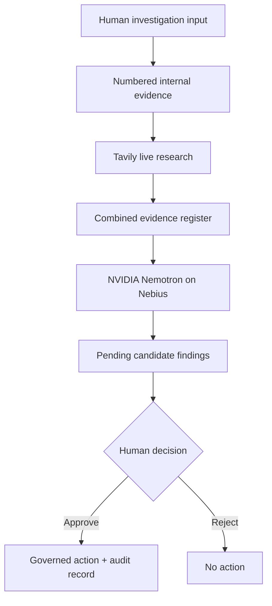

# ShieldOn · Governed Business Investigation

[](https://shieldon-nebius-challenge.vercel.app)
[](https://build.nvidia.com/)
[](https://nebius.com/services/token-factory)
[](./LICENSE)

ShieldOn turns fragmented business evidence into traceable candidate findings, grounds them with live external research, and prevents AI-generated recommendations from becoming authorised actions without an explicit human decision.

**Live application:** https://shieldon-nebius-challenge.vercel.app

## The problem

Business teams increasingly use AI to analyse operational data, but a plausible answer is not the same as a governed decision. Sources are often lost, external claims are mixed with internal facts, and recommended actions can appear without an accountable reviewer.

ShieldOn makes that boundary visible:

1. A reviewer defines an investigation and enters 1–6 internal evidence items.
2. Tavily generates current external context from the live case, not from a fixed query.
3. NVIDIA Nemotron analyses one numbered evidence register through Nebius Token Factory.
4. Every candidate finding must cite evidence IDs from that register.
5. No action is unlocked while a finding is pending or rejected.
6. A human approval creates an auditable decision record and governed action.

## Why it is different

Most AI investigation demos optimise for autonomous output. ShieldOn optimises for **bounded authority**. The model can investigate and recommend, but it cannot approve its own work. That is enforced in application logic and covered by automated tests, not left as prompt wording.

## Architecture



### Technology

- **NVIDIA Nemotron 3 Super 120B** produces structured, evidence-bound candidate findings and specific reversible next actions.
- **Nebius Token Factory** serves the open NVIDIA model through an OpenAI-compatible inference endpoint.
- **Tavily Search** retrieves up to three live sources from a query derived from the investigation objective and evidence signals. URLs, source domains, excerpts and relevance scores remain visible.
- **Next.js 16 + TypeScript** provide the public application and server-side API boundary.
- **Node test runner** verifies the negative governance boundary, input validation, Tavily traceability and Nemotron response normalisation.

## Governance invariant

> A pending or rejected candidate finding must never produce a governed action.

All model findings are normalised to `pending`, even if a model response attempts to provide another decision. Evidence IDs outside the supplied register are rejected. Only the human decision handler can change governance state and create the decision record.

## Try the judge flow

1. Open the [live demo](https://shieldon-nebius-challenge.vercel.app).
2. Expand **Configure investigation**.
3. Edit the case objective and evidence, or keep the seeded revenue-leakage example.
4. Select **Run grounded investigation**.
5. Inspect the Tavily query, external citations and evidence IDs linked to each Nemotron finding.
6. Add a reviewer rationale, then approve or reject a finding.
7. Confirm that only approval unlocks an action, and export the decision register.

## Local development

Requirements: Node.js 20+ and API keys for Nebius Token Factory and Tavily.

```bash
git clone https://github.com/Fami80/shieldon-nebius-challenge.git
cd shieldon-nebius-challenge
npm install
cp .env.example .env.local
npm run dev
```

Add the following values to `.env.local`:

```dotenv
NEBIUS_API_KEY=your_nebius_token_factory_key
TAVILY_API_KEY=your_tavily_api_key
NEBIUS_BASE_URL=https://api.tokenfactory.us-central1.nebius.com/v1
NEBIUS_MODEL=nvidia/nemotron-3-super-120b-a12b
```

Never commit `.env.local`.

## Verification

```bash
npm run test
npm run lint
npm run typecheck
npm run build
```

The test suite covers:

- pending and rejected findings cannot create actions;
- only explicitly approved findings create actions;
- arbitrary model-supplied approval is removed;
- evidence references must exist in the active register;
- custom investigation input is bounded and validated;
- Tavily results retain traceable URLs and relevance;
- common Nemotron JSON response variations are safely normalised.

## Built during the challenge

This repository is a focused challenge edition derived from the broader ShieldOn product direction. During the submission period, this implementation added the public investigation interface, custom evidence intake, dynamic Tavily research, Nebius-hosted Nemotron analysis, structured response normalisation, evidence-level traceability, human approval/rejection controls, governed action generation, an exportable decision audit trail, tests and public deployment.

It does not include ShieldOn customer data, private commercial methodology or unrelated production architecture.

## Feedback on the stack

Nebius Token Factory made it straightforward to use a large NVIDIA open model behind a familiar chat-completions API. Nemotron handled structured evidence synthesis well, but real responses still varied in JSON envelope and field naming, so the application deliberately validates and normalises every response. Tavily was most valuable when treated as part of the visible evidence register rather than as hidden prompt context: judges and human reviewers can inspect exactly which external sources influenced a finding.

## License

[MIT](./LICENSE)
